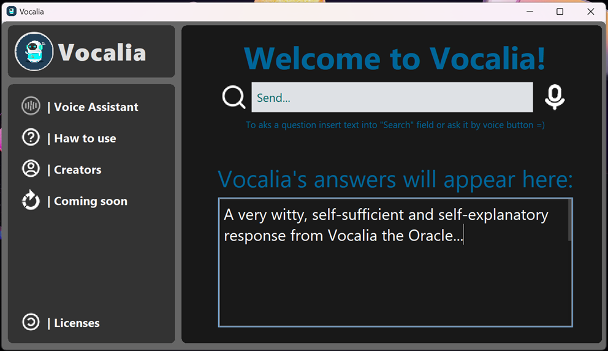
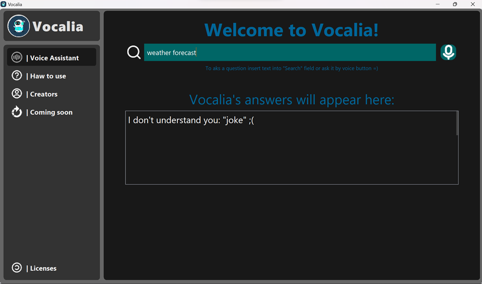
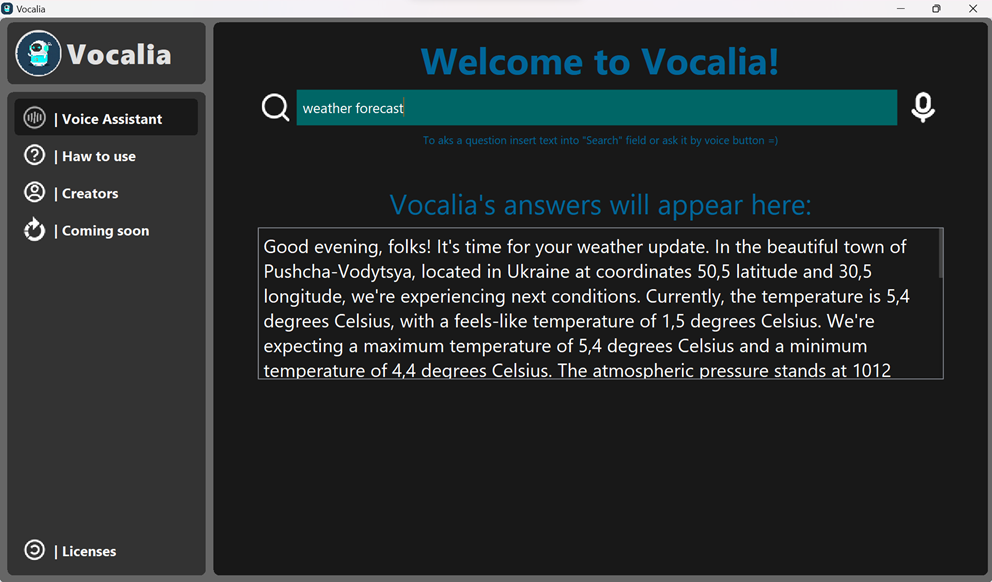
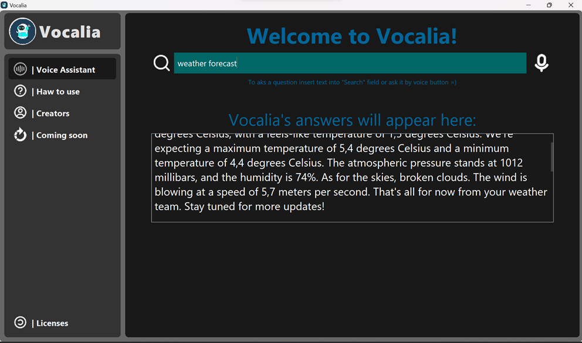
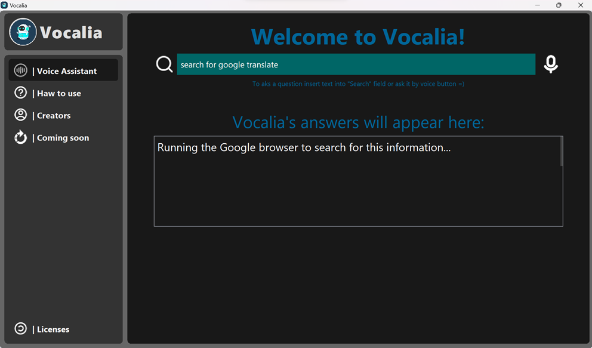
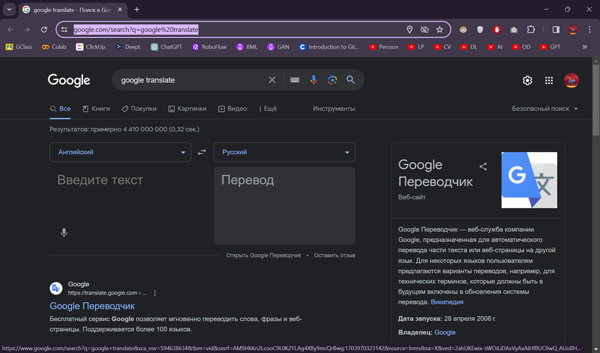
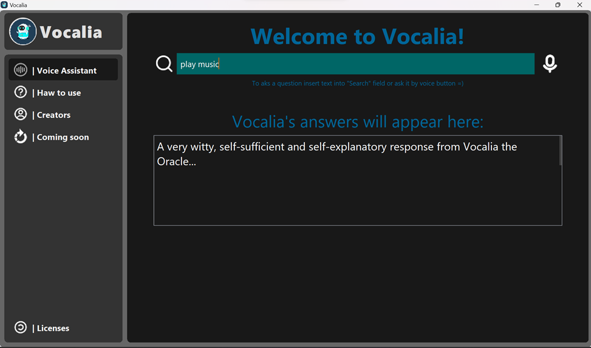
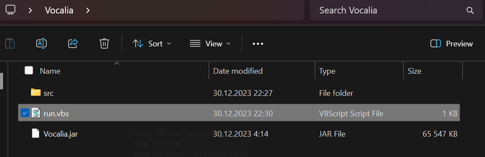
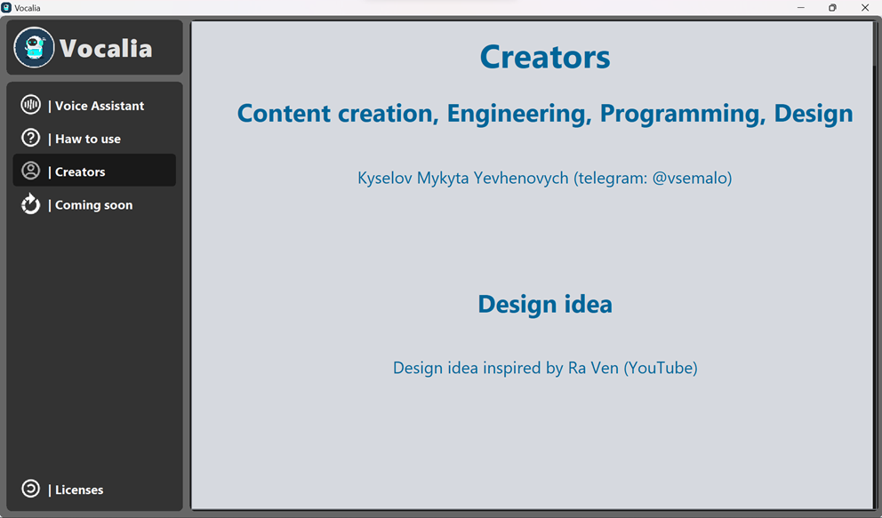
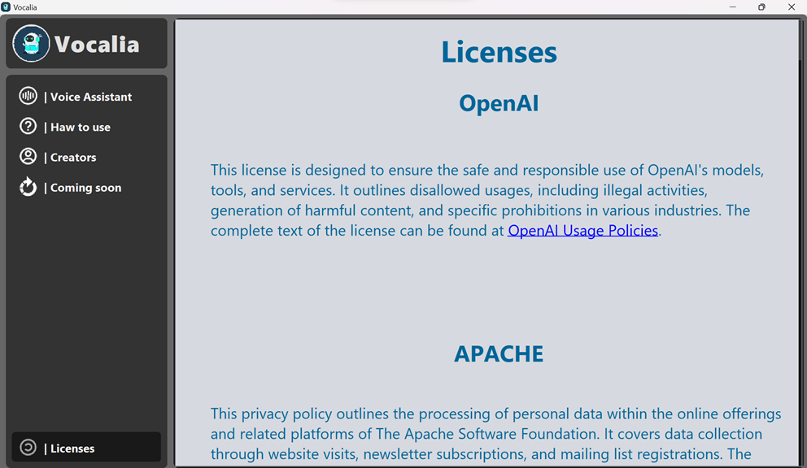

# Abdullah Assists

> A Java-based intelligent voice and chat assistant with a modern dark-themed desktop UI.

## Overview

Abdullah Assists is a feature-rich desktop virtual assistant built with Java Swing. It accepts input through both **voice commands** (via CMU Sphinx4 speech recognition) and a **text interface**, responding with synthesized speech (FreeTTS) and on-screen answers. The assistant integrates real-time weather data, multilingual translation, AI-generated jokes using a Markov Chain language model, web search, YouTube Music playback, and system application control — all within a polished 1280×720 dark-themed GUI.

## Key Features

- 🎙️ **Voice Recognition** — Offline speech-to-text powered by CMU Sphinx4 with a custom vocabulary and language model
- 🔊 **Text-to-Speech** — Responses spoken aloud via FreeTTS (Kevin16 voice)
- 🌤️ **Weather Forecast** — Retrieves live weather data from OpenWeatherMap based on auto-detected geolocation (IPInfo)
- 🌐 **Web Search** — Opens Google search results for any query in the system's browser
- 🎵 **Music Playback** — Redirects to YouTube Music with the requested song or artist
- 🤖 **AI Joke Generator** — Generates contextual jokes using a custom n-gram Markov Chain NLP model (MCNPLNN)
- 🌍 **Language Translation** — Translates text to Urdu via a Google Apps Script translation endpoint
- 📅 **Date & Time** — Speaks and displays the current date and time on request
- 🖥️ **App Control** — Opens and closes macOS/Windows applications by name via voice or text command
- 🎨 **Custom Swing UI** — Dark-themed interface with rounded panels, custom scrollbars, and fullscreen toggle on double-click

## Tech Stack

| Category       | Technology                                              |
|----------------|---------------------------------------------------------|
| Language       | Java 17                                                 |
| Build Tool     | Apache Maven                                            |
| UI Framework   | Java Swing (Nimbus L&F, MigLayout, NetBeans AbsoluteLayout) |
| Speech Input   | CMU Sphinx4 (`sphinx4-core`, `sphinx4-data`)           |
| Speech Output  | FreeTTS (`freetts`)                                     |
| Audio Playback | JLayer (`jlayer`)                                       |
| Weather API    | OpenWeatherMap REST API                                 |
| Geolocation    | IPInfo API (`ipinfo-api`)                               |
| Translation    | Google Apps Script (custom deployment)                  |
| NLP Model      | Custom Markov Chain (MCNPLNN) — n-gram language model  |
| JSON Parsing   | Gson, org.json                                          |
| Utilities      | Apache Commons Lang3, Commons Math3                     |
| Code Quality   | JetBrains Qodana (JVM linter)                          |

## Installation

### Prerequisites

- Java 17 or later
- Apache Maven 3.6+
- Internet connection (for weather, translation, and search features)
- Microphone (for voice input)

### Steps

```bash
# 1. Clone the repository
git clone https://github.com/vanix056/ABDULLAH-ASSISTS.git
cd ABDULLAH-ASSISTS

# 2. Install dependencies
mvn install

# 3. Build the project
mvn package

# 4. Run the application
mvn exec:java -Dexec.mainClass="com.nust.abdullahmaven.abdullahAssists"
```

> **Note:** Model files (`dict.dic`, `language-model.lm`) and audio assets must be present under `src/main/java/com/nust/resources/`.

## Usage

Once launched, the application presents a 1280×720 dark-themed window with a sidebar navigation and a central chat panel.

**Text Input:**
1. Click the search field to activate it.
2. Type a command (see supported commands below).
3. Press `Enter` or click the search icon to submit.

**Voice Input:**
1. Click the microphone icon to begin listening.
2. Speak a supported command clearly.
3. Abdullah processes the command and responds in text and speech.

**Double-click** anywhere on the window chrome to toggle fullscreen mode.

### Supported Commands

| Command Keyword         | Action                                                   |
|-------------------------|----------------------------------------------------------|
| `play music <song>`     | Opens YouTube Music and searches for the song            |
| `search for <query>`    | Opens Google in the browser with the query               |
| `weather forecast`      | Returns live weather for your current location           |
| `translate <text>`      | Translates text into Urdu                                |
| `joke`                  | Generates a joke using the Markov Chain AI model         |
| `hey abdullah`          | Greets the assistant                                     |
| `time`                  | Speaks and displays the current time                     |
| `date`                  | Speaks and displays the current date                     |
| `open app <name>`       | Opens a named application on the system                  |
| `close app <name>`      | Closes a named application on the system                 |
| `bye abdullah`          | Exits the application                                    |

> Each command supports many natural language variants (e.g., "what's the weather", "find information on", "launch application").

## Project Structure

```
ABDULLAH-ASSISTS/
├── src/main/java/com/nust/
│   ├── abdullahmaven/
│   │   └── abdullahAssists.java       # Main JFrame entry point
│   ├── ai/
│   │   ├── VoiceAssistant.java        # Speech recognition & command dispatch
│   │   ├── Synthesizer.java           # FreeTTS text-to-speech (Singleton)
│   │   ├── MCNPLNN.java               # Markov Chain NLP joke generator
│   │   ├── OWMForecaster.java         # OpenWeatherMap weather integration
│   │   ├── GoogleTranslator.java      # Google Apps Script translation client
│   │   └── sphinxextextension/        # CMU Sphinx4 extensions
│   ├── form/
│   │   ├── InitForm.java              # Main chat/command panel
│   │   ├── manualForm.java            # Help & command reference panel
│   │   ├── CreatorsForm.java          # About / creators panel
│   │   └── LicensesForm.java          # Licenses panel
│   ├── component/
│   │   └── Menu.java                  # Sidebar navigation menu
│   ├── swing/
│   │   ├── RoundPanel.java            # Custom rounded panel component
│   │   ├── ImageAvatar.java           # Circular avatar component
│   │   ├── PanelLoading.java          # Loading animation panel
│   │   ├── ButtonMenu.java            # Styled menu button
│   │   └── scrollbar/                 # Custom scrollbar UI
│   ├── apputils/
│   │   └── AppUtils.java              # Constants, color palette, URL utility
│   └── event/
│       └── EventMenu.java             # Menu selection callback interface
├── model/
│   ├── dict.dic                       # Sphinx4 pronunciation dictionary
│   ├── language-model.lm              # Sphinx4 n-gram language model
│   └── mctext.txt / dataset files     # Markov Chain training corpus
├── images/                            # Application screenshots
├── pom.xml                            # Maven build configuration
└── qodana.yaml                        # JetBrains Qodana static analysis config
```

## Model Architecture

**MCNPLNN — Markov Chain Natural Language Processing Neural Network**

The joke generator (`MCNPLNN`) uses an n-gram Markov Chain model trained on a curated joke corpus:

- **State Representation:** Each state is an n-gram of `n` consecutive words (default: 4-gram)
- **Transition Matrix:** A `Map<String, Map<String, Double>>` storing weighted transition probabilities between states
- **Training:** The model reads a cleaned word list from the corpus file and computes relative transition frequencies
- **Inference:** Given a seed phrase (e.g., `"okay heres the joke"`), it stochastically samples the next n-gram until a termination condition or token budget is reached
- **Output:** Post-processed for punctuation, capitalization, and readability

## Dataset

The Markov Chain model is trained on a plain-text joke corpus stored at:

```
src/main/java/com/nust/resources/mctext.txt
```

The file contains pre-cleaned, lowercase text used to build the transition model at runtime. Additional raw datasets and model artefacts are included in the `model/` directory.

## Configuration

The following external API keys are embedded in `InitForm.java` and should be replaced with your own credentials before deployment:

| Service             | Parameter        | Description                              |
|---------------------|------------------|------------------------------------------|
| IPInfo              | `IPInfoId`       | Token for IP geolocation lookups         |
| OpenWeatherMap      | `OWMId`          | API key for weather forecast data        |
| Google Apps Script  | `deployId`       | Deployment ID for the translation script |

> ⚠️ It is strongly recommended to move these values into environment variables or a configuration file rather than hardcoding them in source.

**Sphinx4 resources** (dictionary + language model) are resolved relative to `System.getProperty("user.dir")` at runtime. Ensure the working directory is the project root when launching.

## Screenshots












## Contributing

1. Fork the repository and create a feature branch from `main`.
2. Follow existing code style and package conventions.
3. Ensure all existing functionality remains intact before opening a pull request.
4. Write clear, concise commit messages.
5. Open a pull request describing your changes and the problem they solve.

## License

This project is licensed under the [MIT License](LICENSE).

## Author

**Muhammad Abdullah Waqar**  
Student, National University of Sciences and Technology (NUST)  
GitHub: [@vanix056](https://github.com/vanix056)
